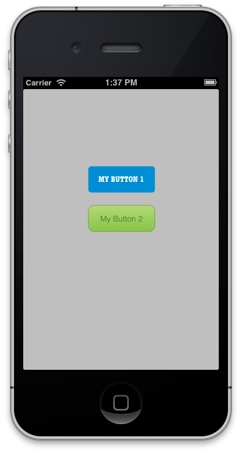

# Pixate Freesytle

Pixate Freestyle is a native iOS and Android library that styles native controls with CSS. With Freestyle, you can replace many complicated lines of code with a few lines of CSS. This simplifies and centralizes your styling code, and [offers other benefits](http://www.pixate.com/) as well.

## Example CSS

A quick example of what you can do in Freestyle, here is some sample CSS and the result you get in your app:

```css
#button1 {
      border-radius    : 5px;
      font-family      : "American Typewriter";
      font-size        : 13px;
      font-weight      : bold;
      text-transform   : uppercase;
      letter-spacing   : 0.75px;
      color            : #ffffff;
      background-color : #008ed4;
    }
    #button2 {
      color            : #446620;
      background-color : linear-gradient(#87c44a, #b4da77);
      border-width     : 1px;
      border-color     : #84a254;
      border-style     : solid;
      border-radius    : 10px;
      font-size        : 13px;
    }
```




